# Data-Structure Project

* This project's menu is in console, the main focus is on the algorithms.

## This project is for restaurant administraition for the following matarials 
 * storing customer's data 
 * storing foods and their requirments 
 * geting service and finding the shortes path to deliver the food
 * finding the shortest path among all the tables
 * assigning turns to each customer that enters & taking their services by their priority 

## Welcome page 
* This welcome will be shown for 4 seconds then the main menu will apear.

# Main menu 
* This program contains 4 different part each one will be expalined later 

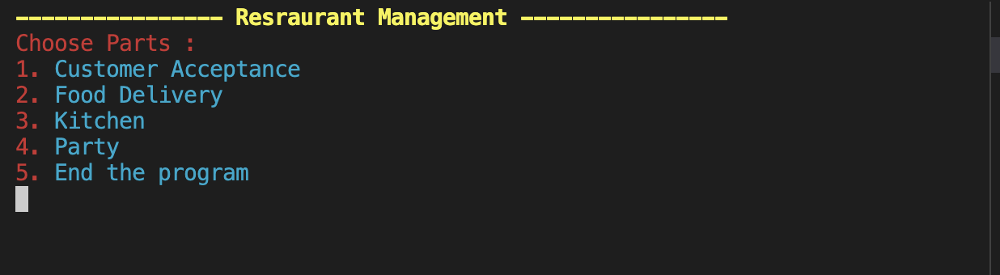

## 1. Customer Acceptance 

* In this part you may add customer's information saud as follow 

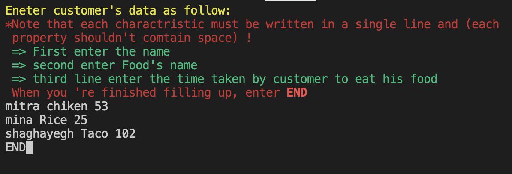

## 2. Delivery

* In order to use all functions in this part first you may enter the restaurant 's map , if you don't do so you'll be warned.

   Map's enteries should have the following format with opetional number of size and characters' place :

      #+#+$++++#
      +#++#+###+
      a+###++#++
      +#++#+b+#+
      #+c+#+++##
      ++#+##++++
      ##+#+##+++
      ++++#e#+##
      ++#++##+#+
      d####+++#+
      
 * English characters(a,b,..c) are presented as tables.
 * "$" is used as kitchen .
 * "#" shows the obstacles in waitress way to deliver food.
 Other testcases for map can be find here { https://github.com/Mitraaaaa/Restaurant/tree/main/Maps }.
      
### Deliver Fucntions 
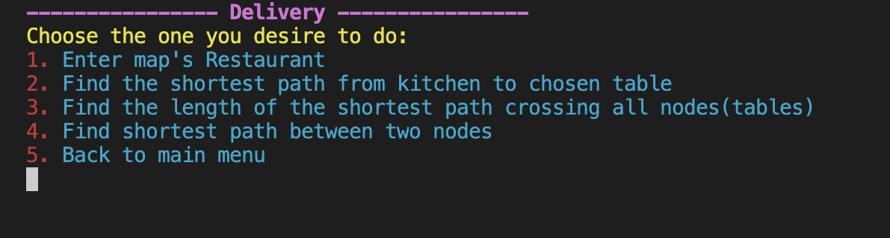
  * Finding the shortest path (Bfs is used for the calculating the following function).
  
  * Finding the shortest path crossing all the nodes (Travel’s salesman problem) --> (Dynamic Programming and Recursive algorithm is used for this part).
  
  * Finding the shortets path between to two desired table.

* Maps entery :
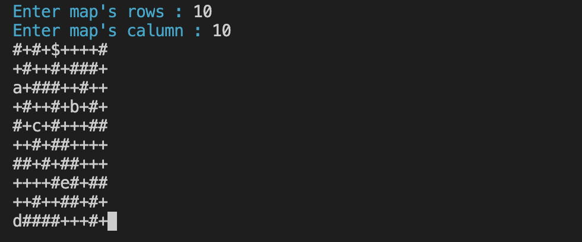

* Shortest path from kitchen to any optional table you desire : 
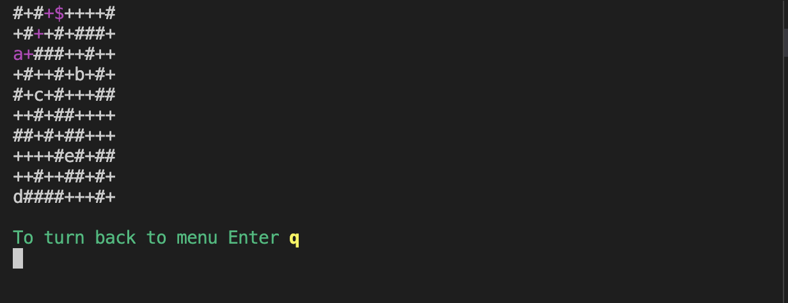

* Shortest path length passing all the tables :
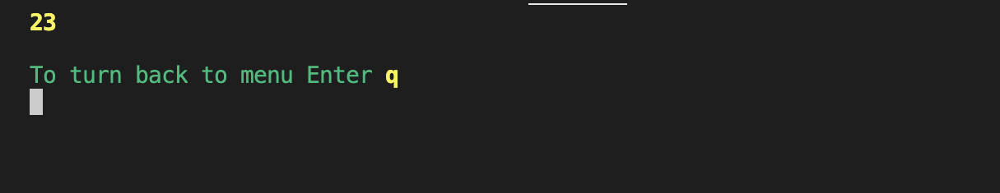
 
 
* Shortest path between two desired tables :
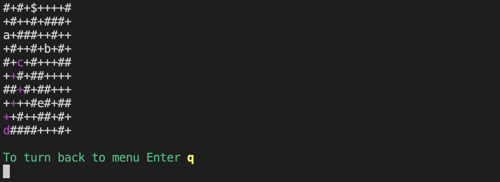

## 3. Kitchen 
* Algorithms of this part are Graph algorithms including BFS and Topilogical Sort .
* Sample format of foods can be seen here {https://github.com/Mitraaaaa/Restaurant/tree/main/Food%20Recipes }
    
    * Kitchen Menu
   
    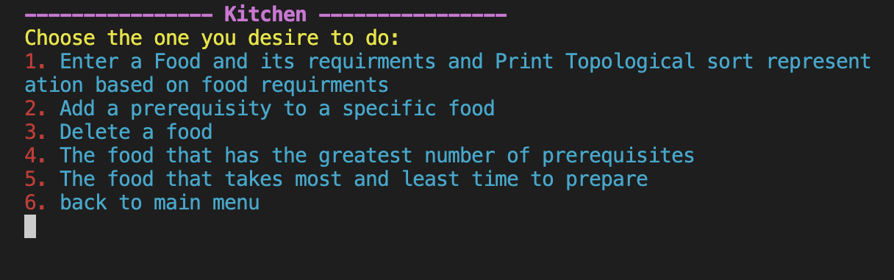
     
    ## This part gives the abilities to :
    * Enter foods'name and it's prerequisites (The Format is written in each option).
   
     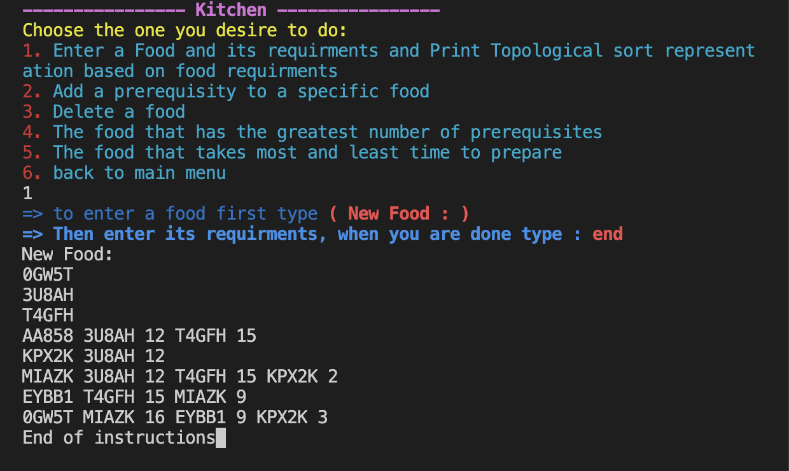
     
    * also you may print the Topoligical sort( sort by number of prerequisites).
   
     
     
     
    * Add a relation to a food you desire :

    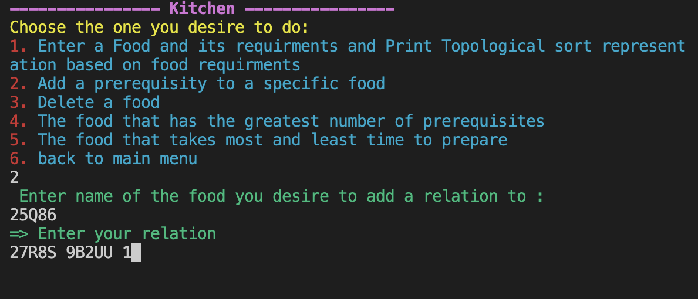
    
    
## 4.Party 
* This part is written by Avl tree. It addes people by names and their turns.
    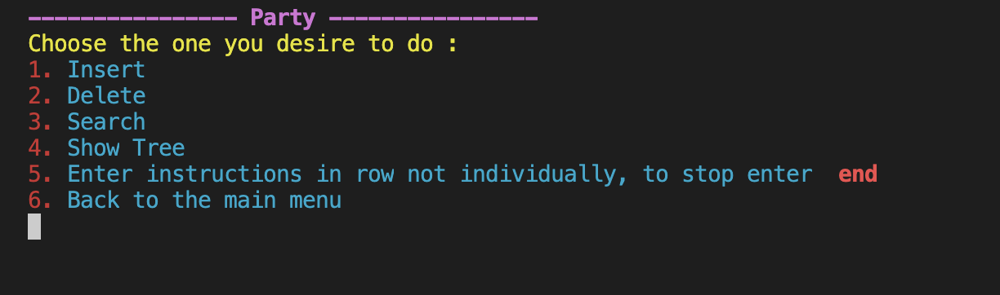
    
    ### Party Functions :
    * Add people's names and turns:
    
    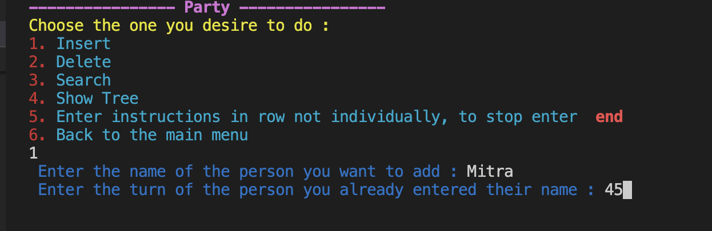
    
    * Show the tree created by their names based on their turns :

    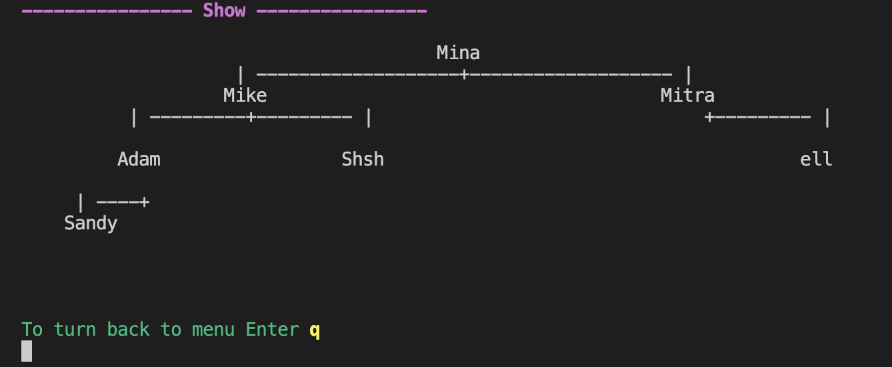

    * Deletes the nodes given either name or their turn (for example deletes Mike) :

     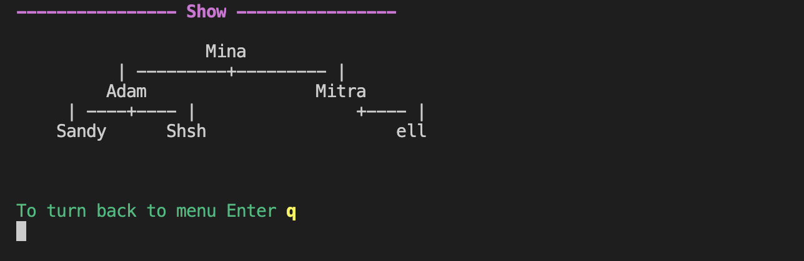

    * Get the whole instructions all at once and do them :

    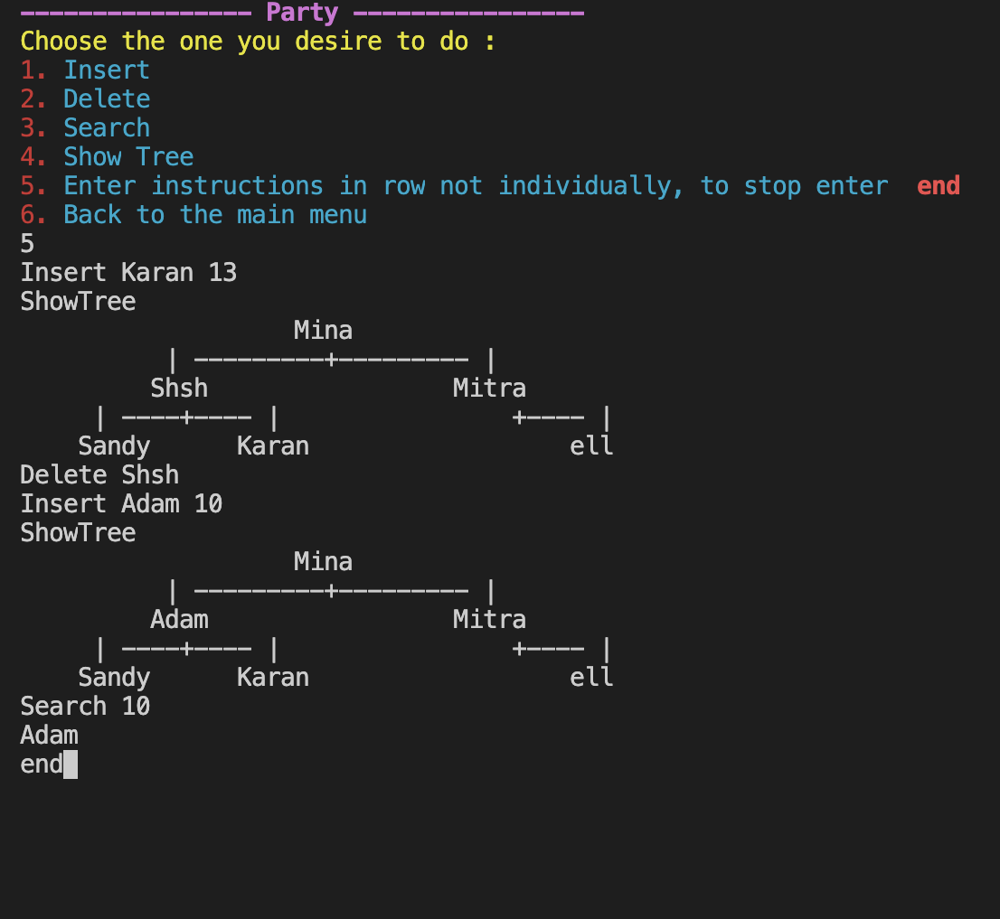
    
    * Search people by their turn (the last operation shown in the last picture which gives Adam by the turn 10) :

